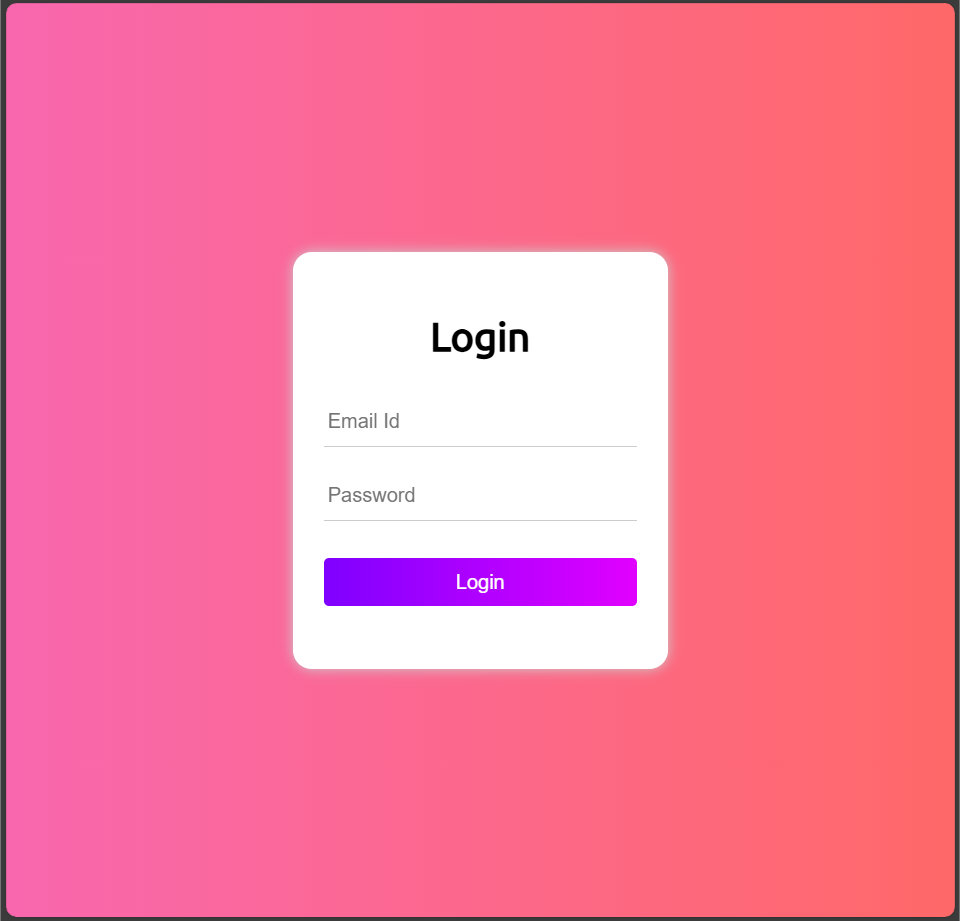
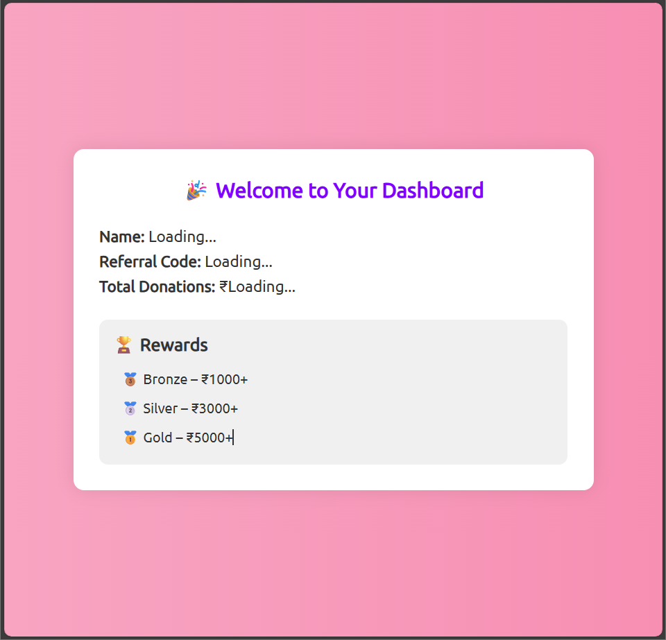

# Fundraising Intern Portal

A simple full stack fundraising intern dashboard built as part of Round 1 for the Full Stack Developer Internship. The project includes a dummy login page, a dashboard with referral details and rewards, and a backend API providing mock user data.


## 🔗 Live Demo

🔗 GitHub Repository: [https://github.com/your-username/fundraising-intern-portal](https://github.com/your-username/fundraising-intern-portal)


## 💻 Features

### Frontend:
- 🔐 Dummy login page with animated UI (no actual auth)
- 📊 Dashboard displaying:
  - Intern Name
  - Referral Code
  - Total Donations Raised (via API)
  - Static Rewards section
- 🏆 Optional static leaderboard page

### Backend:
- Built with **Node.js + Express**
- Exposes one REST API endpoint:  
  `GET /api/intern` → returns mock intern data

```json
{
  "name": "Kiran Yadav",
  "referralCode": "kiran2025",
  "donations": 3700
}

## 📂 Folder Structure

├── css/
│   └── style.css           # Styles for login and dashboard
├── js/
│   └── dashboard.js        # Fetch API logic for dashboard
├── index.html              # Login page (dummy)
├── dashboard.html          # Main intern dashboard
├── server.js               # Node.js backend server
└── README.md               # Project documentation
└──Screenshots

## 🚀 How to Run Locally

### 1. Clone the repository

git clone https://github.com/your-username/fundraising-intern-portal.git
cd fundraising-intern-portal

### 2. Install and Run Backend

npm install
node server.js

🔗 API available at: `http://localhost:5000/api/intern`


## 🎯 Screenshots

### 🔐 Login Page  


### 📊 Dashboard  



## 🧠 Tech Stack

* **Frontend**: HTML, CSS, JavaScript
* **Backend**: Node.js, Express

## 👩‍💻 Author

**Resham Yadav**
Email: [iryadav2702@gmail.com](mailto:iryadav2702@gmail.com)

